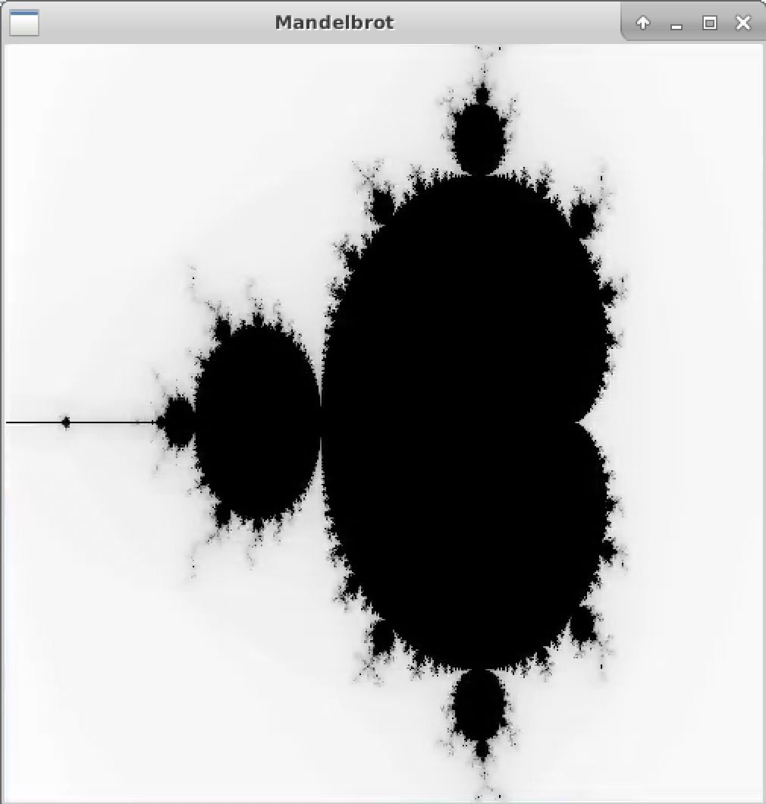
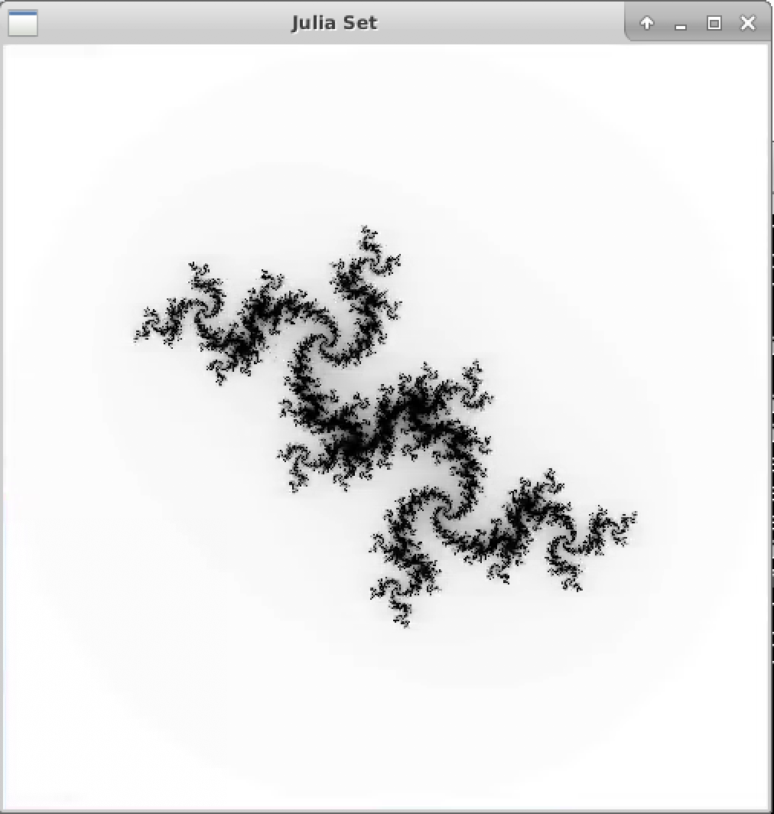
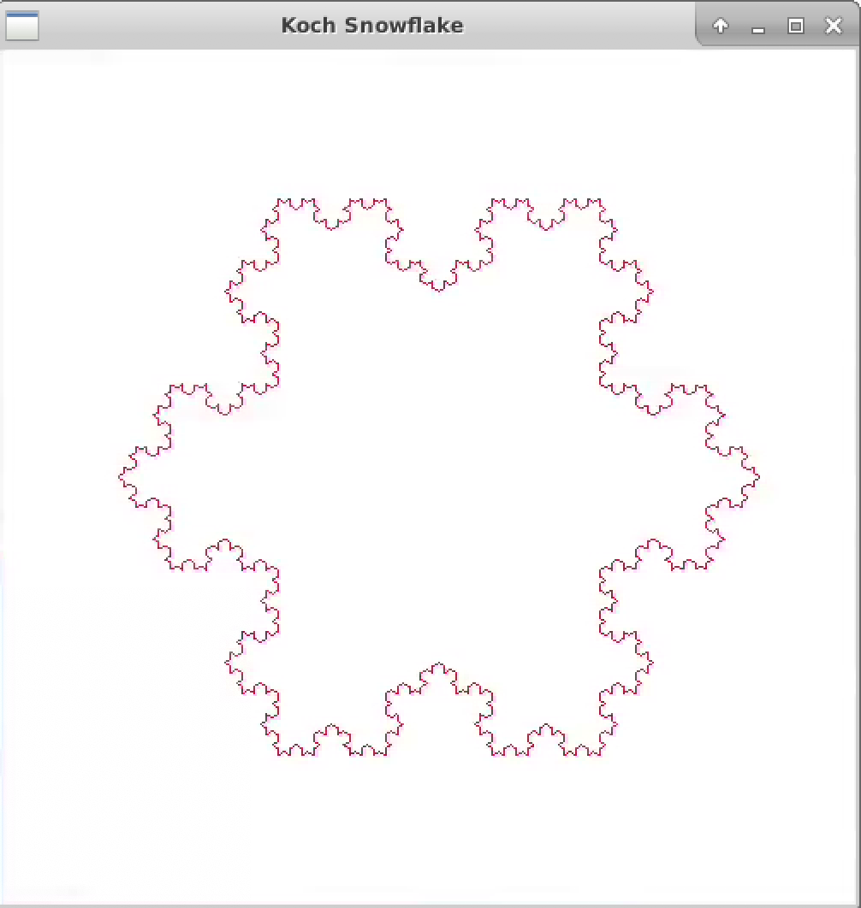
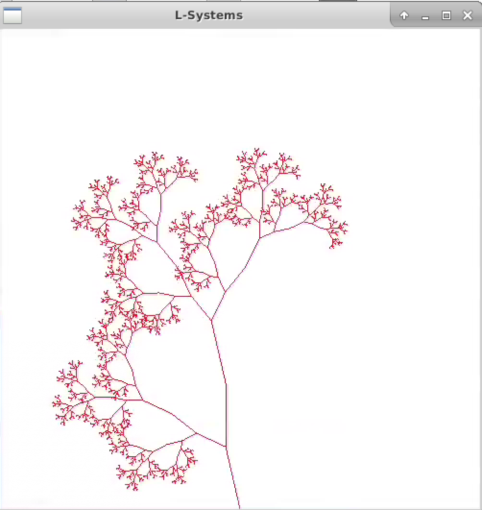

# Fractals for OpenGL 
### Writen by Josh Norman

Source:[Wikipedia](https://en.wikipedia.org/wiki/Mandelbrot_set)

---

Fractals are self repeating mathematical constructs. That lead to complex models that are organic in design. While many fractal patterns were used a screensave or backgrounds of early 2000s computer, they many a multude of applications within computer graphics for modeling organic structures. 

---

### This folder contains the following implementations of Fractals:

- Mandelbrot :white_check_mark: ( March 11, 2020 )
    - Additional Features to be added: Improved shading :white_check_mark:
- Julia Set :white_check_mark: (April 29, 2020 )
- Koch Snowflake :white_check_mark: ( April 30, 2020 )
- Trees (Grammar Generated) :white_check_mark: ( April 30, 2020 )
    
>*Each of the Fractal designs may have a unquie compilation signature which will be specified within a header at the top of each file.*
___
## Usage of the Fractal Library 
Mandelbrot Set            |  Julia Set
:-------------------------:|:-------------------------:
 |  

Koch Snowflake           |  Tree ( Grammar Generated)
:-------------------------:|:-------------------------:
 |  

--- 
## Resources 

#### Mandelbrot Set
* **General Information**
    * [Mandelbrot Set](https://en.wikipedia.org/wiki/Mandelbrot_set)
    * [Mathematical Implementation of the Mandelbrot Set](https://mathworld.wolfram.com/MandelbrotSet.html)
    * [Complex Numbers](https://en.wikipedia.org/wiki/Complex_plane)
    * [Complex Plane](https://mathworld.wolfram.com/ComplexPlane.html)
    * [Converting Cartesian Plane to Complex Plane](http://warp.povusers.org/Mandelbrot/)

#### Julia Set
* **General Information**
    * [Julia Set](https://en.wikipedia.org/wiki/Julia_set)
    * [Understanding Julia and Mandelbrot Sets](https://www.karlsims.com/julia.html)
    * [Complex Numbers](https://en.wikipedia.org/wiki/Complex_plane)
    * [Complex Plane](https://mathworld.wolfram.com/ComplexPlane.html)
    * [Converting Cartesian Plane to Complex Plane](http://warp.povusers.org/Mandelbrot/)

#### Koch's Snowflake
* **General Information**
    * [Koch Snowflake](https://en.wikipedia.org/wiki/Koch_snowflake)
    * [The Koch Snowflake (implementation)](https://python-with-science.readthedocs.io/en/latest/koch_fractal/koch_fractal.html)
    * [Koch curves](http://ai.toastbrot.ch/life/koch.php)
    * [L-Systems](https://en.wikipedia.org/wiki/L-system)

#### Trees (Grammar Generated)
* **General Information**
    * [Drawing Organics](https://www.vexlio.com/blog/drawing-simple-organics-with-l-systems/)
    * [L-System Powerpoint](https://www.cs.utexas.edu/~theshark/courses/cs354/lectures/cs354-22.pdf)
    * [L-Systems](https://en.wikipedia.org/wiki/L-system)
*** 

